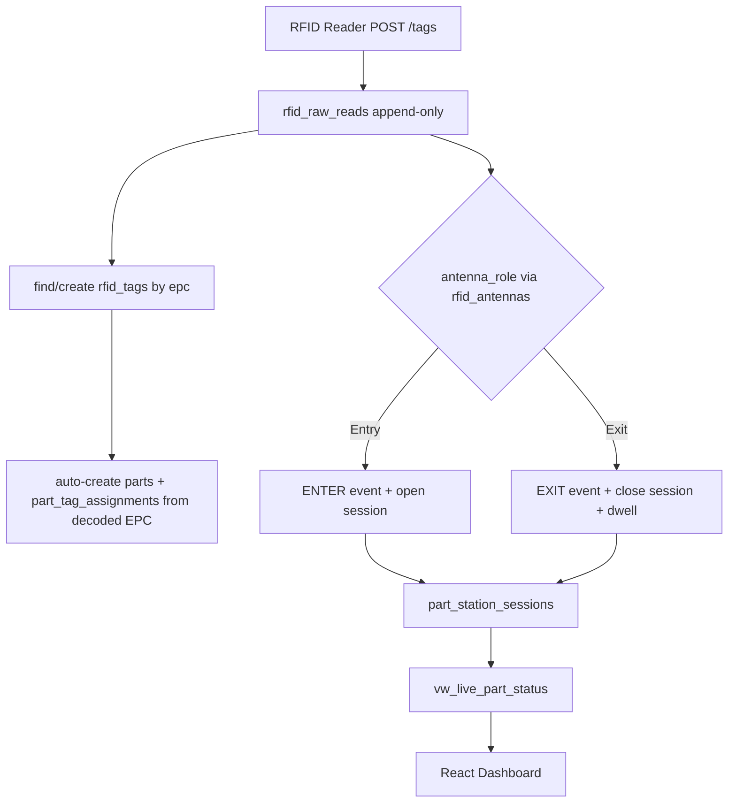

# RFID Normalized Schema Redesign

Full redesign per [Database.md](Database.md). Fresh start (old data archived), full API + frontend rework.

## Decisions locked in

- **Data strategy:** Fresh start. The old `rfid_reads.db` is backed up (`database/rfid_reads.db.bak-<date>`) and rebuilt clean.
- **Dashboard:** Full rework of the API + React frontend to expose the new schema (parts, stations, antenna, etc.).
- **Operators:** In scope for the POC as tables + read endpoints only. Assignment/RTLS matching logic deferred.

## Data flow (new)

## 1. Schema - rewrite `database/migrate.py`

Discard old migrations. New migration set builds 12 tables (SQLite translation of the SQL Server DDL: `BIGINT IDENTITY` to `INTEGER PRIMARY KEY AUTOINCREMENT`, `NVARCHAR` to `TEXT`, `DATETIME2` to `TEXT` ISO-UTC, `BIT` to `INTEGER`, `SYSUTCDATETIME()` to `strftime('%Y-%m-%dT%H:%M:%SZ','now')`):

Core (9):
- `rfid_tags` (epc UNIQUE), `parts`, `part_tag_assignments`
- `stations`, `rfid_readers`, `rfid_antennas` (has `antenna_role` Entry/Exit + `station_id` - this makes entry/exit relative to the machine)
- `rfid_raw_reads` (has `antenna_id` + `antenna_port` + `rssi` + `read_status`/`is_stale` - this records which antenna every read is at)
- `part_station_events`, `part_station_sessions`

Operators (3, per Database.md section 6 - tables + read endpoints only, assignment logic deferred):
- `operators` (employee_number, operator_name, rtls_badge_id, is_active)
- `operator_station_presence` (RTLS presence rows; FKs to operators + stations)
- `part_operator_assignments` (links a session to an operator; FKs to part_station_sessions + operators)

- View `vw_live_part_status` (joins sessions/parts/tags/stations)
- All recommended indexes from Database.md sections 5.7 and 13.3

Seed data (section 12): 5 stations (Gannomat/Tennoner/Insert Station/Anderson/Final Packing), the reader from config, and its two antennas (port 1 = Entry, port 2 = Exit).

## 2. Fresh start

Back up existing `database/rfid_reads.db` to `database/rfid_reads.db.bak-<date>`, then rebuild the new schema clean. (The DB lives inside a OneDrive folder that locks the file against deletion, so the rebuild drops all old objects in-place and reruns migrations rather than deleting the file.)

## 3. Config - `config.py`

Rename location/reader settings to station-oriented: `STATION_NAME` (default "Gannomat"), `STATION_TYPE`, `STATION_LOCATION` (default "TPF CL"), `READER_NAME`, `READER_IP`. Keep `ENTRY_ANTENNA`/`EXIT_ANTENNA` (drive antenna seeding + role lookup). Add `ENTER_EVENT`/`EXIT_EVENT` and `open/closed/abandoned/exit_only` session-status constants.

## 4. Ingest pipeline - rewrite `tracking/storage.py`

Rewrite `DwellTracker.ingest_batch()` to the layered model:
- Always insert every accepted read into `rfid_raw_reads` (append-only source of truth, with `antenna_id`, `rssi`, `reader_timestamp`, `server_received_at`)
- `find_or_create` tag by EPC in `rfid_tags`
- Auto-create `parts` + `part_tag_assignments` from the decoded EPC via `parse_tag_id()` (qty/part_number/type/work_order) so the dashboard shows part detail. Decision: EPC carries part info today, so we parse it into the parts table; skip if already assigned.
- Resolve antenna role from `rfid_antennas` (Entry/Exit) instead of hardcoded antenna numbers
- Entry read + no open session for (tag, station) -> `ENTER` event + open `part_station_sessions` row
- Exit read + open session -> `EXIT` event + close session, `dwell_seconds = exit_time - entry_time`
- Keep RSSI filter, throttle/winner dedup, and the background sweeper (idle/abandon). Debounce ENTER/EXIT per section 9.
- Stale-read guard (section 10): compare `reader_timestamp` vs `server_received_at`.

## 5. API - rewrite `api.py`

Replace tag_reads endpoints with schema-aware ones (reading `vw_live_part_status` / session tables, never raw reads for live status):
- `GET /api/live` (open sessions), `GET /api/completed` (closed)
- `GET /api/raw-reads/recent` (feed showing antenna + role + rssi)
- `GET /api/stations`, `/api/readers`, `/api/antennas`, `/api/parts`, `/api/tags`
- `GET /api/operators` (list operators; plus `/api/operators/<id>/presence` and `/api/sessions/<id>/operators` read endpoints - assignment/write logic deferred)
- `GET /api/summary`, `/api/analytics`, `/api/report/sessions` (rebuilt on new tables, grouped by `station_name`)
- `POST /api/sessions/<id>/end`
- Response fields now include `part_name`, `part_type`, `ibus_number`, `work_order`, `station_name`, `entry_time`, `exit_time`, `dwell_seconds`, `status`, plus antenna info on raw reads.

## 6. Frontend rework - `dashboard/src`

- `pages/LiveDashboard.jsx` + `App.jsx`: point fetches at new endpoints
- `components/LiveQueueTable.jsx`, `CompletedTable.jsx`: use `part_name`/`part_type`/`station_name`/`entry_time`/`exit_time` from DB (fall back to `parseEpc` for unknown tags)
- `components/RecentReadsPanel.jsx`: add Antenna + Role columns from raw reads
- `pages/FullReport.jsx`, `pages/AnalyticsPage.jsx`: rebind to new field names; station grouping now real (multi-station ready)
- `components/SummaryCards.jsx`: keep cards, map to new summary keys

## 7. Tests + tooling

- Rewrite `tests/test_database.py` for the 12 tables (9 core + 3 operator), view, seeds, FK integrity, indexes
- Update `check_db.py` to dump the new schema
- Update `tests/test_api.py` for new endpoints

## Operators - included (tables only)

The 3 operator tables are created and seeded-ready with read endpoints, but assignment/RTLS ingest logic is deferred: no auto-matching, no manual-assign write path yet. This makes the schema ready for operators without building the RTLS pipeline.

## Out of scope (Database.md "Later")

`jobs`, `routing_steps`, `quality_events` - deferred per section 11 POC scope. Operator assignment/RTLS matching logic also deferred (tables exist, population later).

## Verification

Run migrations on a clean DB, `python check_db.py`, `python tests/test_database.py`, start `api.py` + listener, confirm dashboard renders live/completed/raw-reads.

---

## Progress tracker

- [x] Back up existing `rfid_reads.db` and rebuild clean
- [x] Rewrite `database/migrate.py` with 12-table normalized schema (9 core + 3 operator), indexes, view, seed data
- [x] Update `config.py`: station/reader settings + event constants
- [x] Rewrite `tracking/storage.py` ingest into raw-reads -> events -> sessions pipeline
- [x] Update `tracking/listener.py` to pass station/reader identity
- [x] Rewrite `api.py` endpoints around new schema and `vw_live_part_status`
- [x] Rework dashboard components/pages to new API field shapes + antenna columns
- [x] Rewrite `tests/test_database.py`, `tests/test_api.py`, `check_db.py` for new schema
- [x] Run migrations + tests + smoke-test dashboard end to end
